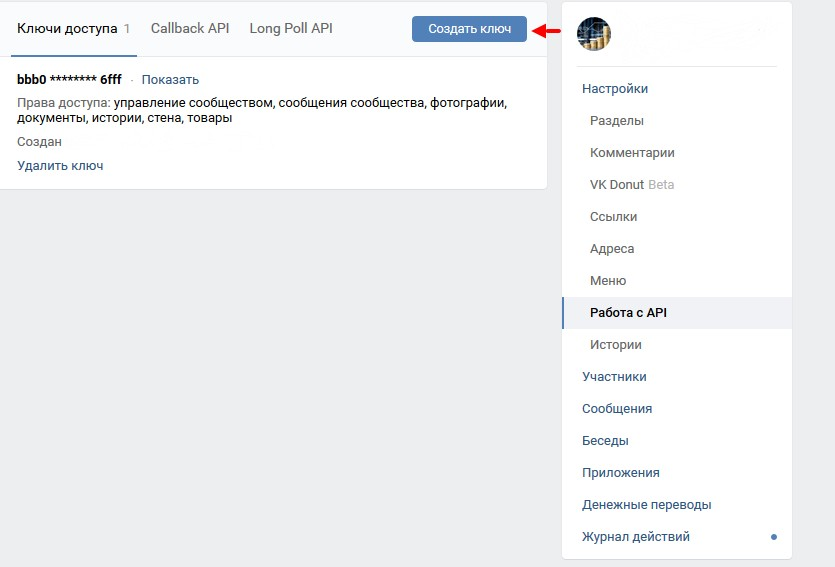

# VK API Provider from JavaStream
Java library for VK API. Easy to install and use! 

You can easy communicate with VK group messages. Other features coming soon!

If you have any questions send me an email: javastream.msn@gmail.com

QUICK START
------------

## Get an ID group in your group settings


## Create an access token 


## Add Maven dependency:
```xml
<repositories>
   <repository>
      <id>vk_api_javastream-mvn-repo</id>
	  <url>https://raw.github.com/JavaStream/vk_api_javastream/mvn-repo/</url>
		 <snapshots>
		     <enabled>true</enabled>
			  <updatePolicy>always</updatePolicy>
		 </snapshots>
   </repository>
</repositories>

<dependency>
    <groupId>com.javastream</groupId>
    <artifactId>vk_api_javastream</artifactId>
    <version>0.3-SNAPSHOT</version>
 </dependency>
  ```

## Create connection and start updates with VK Server
Create Spring boot project and 2 classes. See example in the folder `examples`. First class is the `TestConnect`
```java
@Component
public class TestConnect {

    @Autowired private UpdateProcessService updateProcessService;

    private MessageHandler messageHandler = null;

    private void start() {
        // Setup your id group and access token
        Client client = new Client(170690651, "bbb072f080b094e1c47248b5c694187497714f55e6296e35c253833cb0266316847d0b6273500aefb6fff");
        VkStarter vkStarter = client.initVkService();
        VkMessenger vkMessenger = client.getVkMessanger(vkStarter);

        // We say that we are interested in working with messages in a group
        messageHandler = message -> {
            // Our service where we processing a message 
            updateProcessService.process(vkMessenger, message);
            return message;
        };

        // Running updates
        vkStarter.startUpdates(messageHandler);
    }


    @PostConstruct
    private void run() {
        start();
    }
}
```

## Create your service for processing messages from VK
Second class in the `folder` is the `UpdateProcessService`. He is responsible for processing incoming messages.
```java
@Component
public class UpdateProcessService {

    // The main method of processing updates
    public void process(VkMessenger vkMessenger, Message message) throws ClientException {        // If we received a message "Hello", then we reply "Hello my friend!"
        if (message.getText().contains("Hello")) {
            vkMessenger.sendMessage("Hello my friend!", message);
        }

        // If we received a message "Goodbye", then we reply "Goodbye my friend!"
        if (message.getText().contains("Goodbye")) {
            vkMessenger.sendMessage("Goodbye my friend!", message);      
        }
    }
       
}
```

## Coming Soon
- Sending and receiving photos
- Work with group wall