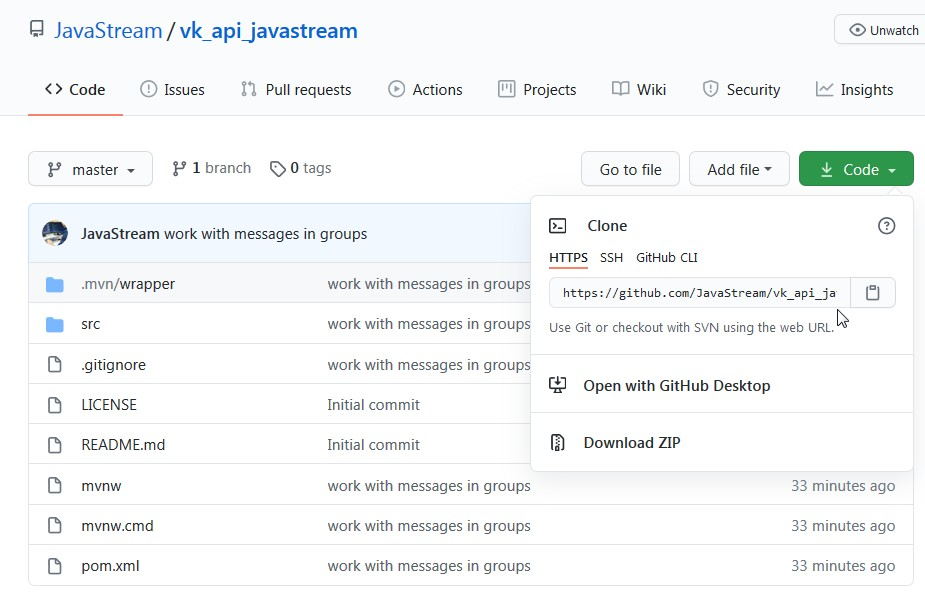

# VK API Provider from JavaStream
Java library for VK API. **Easy to install and use! ** 

You can easy communicate with VK group messages. Other features coming soon!

If you have any questions send me an email: javastream.msn@gmail.com

QUICK START
------------

## Get an access token and ID group in your group settings.


## Download our librari


## Create connection and start updates with VK Server
Create Spring boot project. See example in the `folder` examples in class `TestConnect`
```java
@Component
public class TestConnect {

    @Autowired private UpdateProcessService updateProcessService;

    private MessageHandler messageHandler = null;

    private void start() {
        // Setup your id group and access token
        Client client = new Client(170690651, "bbb072f080b094e1c47248b5c694187497714f55e6296e35c253833cb0266316847d0b6273500aefb6fff");
        Vk_Starter vk_starter = client.initVkService();

        // We say that we are interested in working with messages in a group
        messageHandler = message -> {
            // Our service, where we send a message for processing
            updateProcessService.process(message);
            return message;
        };

        // Running updates
        vk_starter.startUpdates(messageHandler);
    }


    @PostConstruct
    private void run() {
        start();
    }
}
```

## Create your service for processing messages form VK
See example in the `folder` examples in class `UpdateProcessService`
```java
@Component
public class UpdateProcessService {

    @Autowired private Vk_Starter vk_starter;

    // The main method of processing updates
    public void process(Message message) throws ClientException {
        // If we received a message "Hello", then we reply "Hello my friend!"
        if (message.getText().contains("Hello")) {
            vk_starter.getVkMessenger().sendMessage("Hello my friend!", message);
        }

        // If we received a message "Goodbye", then we reply "Goodbye my friend!"
        if (message.getText().contains("Goodbye")) {
            vk_starter.getVkMessenger().sendMessage("Goodbye my friend!", message);        
        }
       
    }
}
```

## Coming Soon
- Sending and receiving photos
- Work with group wall